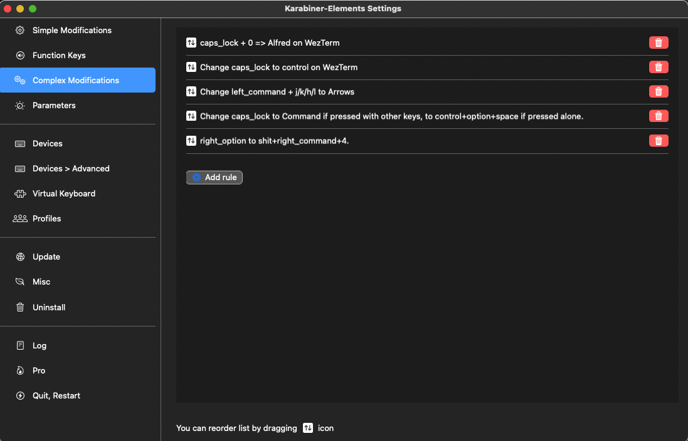
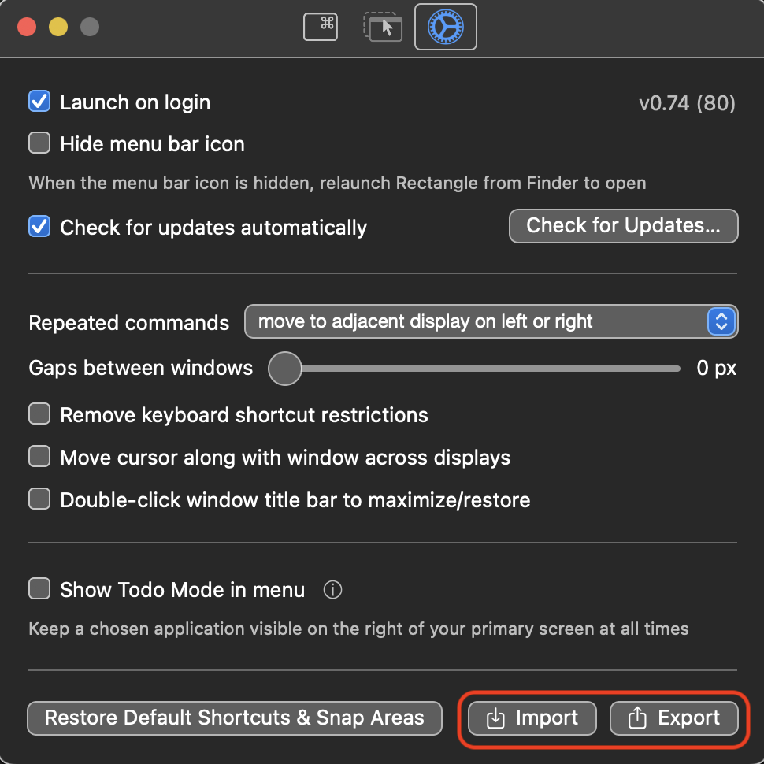

# Portable Configuration Files
## Prerequisite (MacOS)
[Homebrew Bundle, brew bundle and Brewfile — Homebrew Documentation](https://docs.brew.sh/Brew-Bundle-and-Brewfile)
```shell
brew bundle dump --global --force
```
```shell
brew install --cask wezterm
brew install ghq peco coreutils gnu-sed gawk tmux
```

## peco
```shell
mkdir $HOME/.config/peco/
ln -s $(readlink -f .peco/config.json) $HOME/.config/peco/
```

## [pyenv](https://github.com/pyenv/pyenv)

## fish
```shell
ln -s $(readlink -f config.fish) $HOME/.config/fish/
```

## Starship
```shell
curl -sS https://starship.rs/install.sh | sh
ln -s $(readlink -f starship.toml) $HOME/.config/
```

## zsh
```shell
ln -s $(readlink -f .zshrc) $HOME/.zshrc
ln -s $(readlink -f .zsh) $HOME/.zsh
git clone https://github.com/zsh-users/antigen.git ~/antigen
```

### linux
```shell
ln -s $(readlink -f .zlogin) $HOME/.zlogin
```

## git
```shell
ln -s $(readlink -f .gitconfig) $HOME/.gitconfig
```

## tmux
```shell
ln -s $(readlink -f .tmux.conf) $HOME/.tmux.conf
```

## gvm
```shell
zsh < <(curl -s -S -L https://raw.githubusercontent.com/moovweb/gvm/master/binscripts/gvm-installer)
```

## vim
```shell
ln -s $(readlink -f .vimrc) $HOME/.vimrc
ln -s $(readlink -f vim-config) $HOME/.vim/vim-config
curl -fLo ~/.vim/autoload/plug.vim --create-dirs https://raw.githubusercontent.com/junegunn/vim-plug/master/plug.vim
curl -fLo ~/.vim/colors/molokai.vim --create-dirs https://raw.githubusercontent.com/tomasr/molokai/master/colors/molokai.vim
```
Reload .vimrc and `:PlugInstall` to install plugins.

## [gh](https://github.com/cli/cli)
```shell
type -p curl >/dev/null || sudo apt install curl -y
curl -fsSL https://cli.github.com/packages/githubcli-archive-keyring.gpg | sudo dd of=/usr/share/keyrings/githubcli-archive-keyring.gpg \
&& sudo chmod go+r /usr/share/keyrings/githubcli-archive-keyring.gpg \
&& echo "deb [arch=$(dpkg --print-architecture) signed-by=/usr/share/keyrings/githubcli-archive-keyring.gpg] https://cli.github.com/packages stable main" | sudo tee /etc/apt/sources.list.d/github-cli.list > /dev/null \
&& sudo apt update \
&& sudo apt install gh -y
```

## [streamich/git-cz: Semantic Git commits](https://github.com/streamich/git-cz) 
```shell
 ln -s $(readlink -f changelog.config.js) $HOME/
```

## karabiner on Mac
Because symbolic link does not affect correctlly with karabiner, just copy to load and update configuration.
copy json file to your configuration directory.
```shell
cp karabiner.json ~/.config/karabiner/
```
Also karabiner.json is needed to affect on GUI. And the order of rules is important.
The picture below shows it at 2023/01.


If you updated its configuration, then also update repository's one.
1. update your karabiner configuration by Karabiner-GUI.
1. copy json file to this repository.

## [Rectangle](https://rectangleapp.com/)
Please import the json file in this repository.
The picture below show import and export settings.
